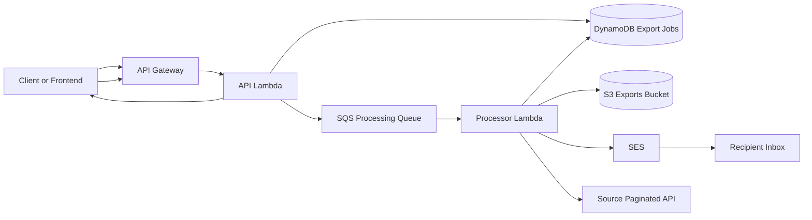

# Data Export Service

Serverless CSV export pipeline built with AWS SAM and TypeScript. The service accepts an export request for a paginated JSON API, fetches the remote dataset page by page, generates a CSV file, uploads it to S3, and emails the requester a presigned download link.

## What This Service Does

- Accepts export jobs through a REST API.
- Stores job state in DynamoDB.
- Pushes work onto SQS so the API stays fast.
- Processes long-running exports in a dedicated Lambda.
- Streams CSV generation to disk to avoid loading the full dataset into memory.
- Uploads completed files to S3 and sends a download email through SES.

## Documentation Map

- `README.md`: service overview, setup, operations, and quick API guide.
- `docs/architecture.md`: architecture, component responsibilities, and sequence diagrams.
- `docs/openapi.yaml`: machine-readable OpenAPI 3.0 specification for the API.

## High-Level Architecture



## Request Lifecycle

1. A client sends `POST /api/v1/exports` with the source API URL, email, and pagination options.
2. The API Lambda validates the request, creates a `pending` export job in DynamoDB, and enqueues the job ID to SQS.
3. The processor Lambda reads the message, marks the job as `processing`, fetches all pages from the remote API, and writes CSV rows to a temp file.
4. The processor uploads the CSV to S3, creates a presigned download URL, updates the job to `completed`, and emails the user.
5. The client can poll `GET /api/v1/exports/{id}` to track progress or retrieve the final download URL.

## Runtime And Infrastructure

The `template.yaml` deployment defines the following resources:

- `ExportApi`: API Gateway stage `v1` with permissive CORS and throttling settings.
- `ApiFunction`: short-lived Lambda for creating jobs and retrieving job status.
- `ProcessorFunction`: long-running Lambda for export processing.
- `ExportProcessingQueue`: SQS queue used to decouple API intake from processing.
- `ExportDeadLetterQueue`: DLQ for messages that exceed the queue retry policy.
- `ExportJobsTable`: DynamoDB table keyed by `id`.
- `ExportsBucket`: S3 bucket for generated CSV files with a 30-day lifecycle policy.

Default function sizing from the SAM template:

- API Lambda: `256 MB`, `29s` timeout.
- Processor Lambda: `1024 MB`, `900s` timeout, `2048 MB` ephemeral storage.

## API Quick Reference

Important deployment detail:

- API Gateway uses stage `v1`.
- The SAM output publishes a base URL like `https://{api-id}.execute-api.{region}.amazonaws.com/v1`.
- Because the route path is also versioned, the full create endpoint becomes `https://.../v1/api/v1/exports`.

### Create Export

- Method: `POST`
- Path: `/api/v1/exports`
- Success: `202 Accepted`

Minimal request:

```json
{
  "apiUrl": "https://api.example.com/orders",
  "email": "ops@example.com"
}
```

Request with all supported options:

```json
{
  "apiUrl": "https://api.example.com/orders",
  "email": "ops@example.com",
  "paginationStrategy": "cursor",
  "headers": {
    "Authorization": "Bearer <token>"
  },
  "queryParams": {
    "status": "active"
  },
  "pageSize": 100,
  "dataPath": "results",
  "cursorPath": "meta.next",
  "cursorParam": "after",
  "fileName": "active-orders"
}
```

Accepted request fields:

- `apiUrl` (`string`, required): fully qualified source API URL.
- `email` (`string`, required): destination email for the export link.
- `paginationStrategy` (`page | offset | cursor`, optional): defaults to `page`.
- `headers` (`Record<string,string>`, optional): request headers forwarded to the source API.
- `queryParams` (`Record<string,string>`, optional): extra query parameters appended to every request.
- `pageSize` (`integer`, optional): defaults to `EXPORT_DEFAULT_PAGE_SIZE`; allowed range is `1..5000`.
- `dataPath` (`string`, optional): dot-notation path to the array of records. Defaults to `data`.
- `cursorPath` (`string`, optional): dot-notation path to the next cursor value. Used by cursor pagination.
- `cursorParam` (`string`, optional): query parameter name for the cursor. Defaults to `cursor`.
- `fileName` (`string`, optional): output file name without the `.csv` extension.

Success response shape:

```json
{
  "id": "550e8400-e29b-41d4-a716-446655440000",
  "status": "pending",
  "totalRecords": 0,
  "pagesProcessed": 0,
  "downloadUrl": null,
  "errorMessage": null,
  "createdAt": "2026-01-15T10:00:00.000Z",
  "startedAt": null,
  "completedAt": null
}
```

### Get Export Status

- Method: `GET`
- Path: `/api/v1/exports/{id}`
- Success: `200 OK`

Example response for a completed export:

```json
{
  "id": "550e8400-e29b-41d4-a716-446655440000",
  "status": "completed",
  "totalRecords": 1500,
  "pagesProcessed": 3,
  "downloadUrl": "https://signed-url.example.com/file.csv",
  "errorMessage": null,
  "createdAt": "2026-01-15T10:00:00.000Z",
  "startedAt": "2026-01-15T10:01:00.000Z",
  "completedAt": "2026-01-15T10:05:00.000Z"
}
```

### Error Responses

Errors are returned as JSON with a common shape:

```json
{
  "statusCode": 400,
  "timestamp": "2026-01-15T10:00:00.000Z",
  "path": "/api/v1/exports",
  "message": [
    "email must be an email"
  ],
  "error": "Bad Request"
}
```

Common status codes:

- `400`: invalid JSON, validation failures, invalid UUID.
- `404`: unknown route or export job not found.
- `500`: unexpected application error.

Full API schema lives in `docs/openapi.yaml`.

## Pagination Behavior

The service supports three pagination strategies:

- `page`: adds `page` and `limit` query params. Page numbering starts at `1`.
- `offset`: adds `offset` and `limit`, where `offset = currentPage * pageSize`.
- `cursor`: adds `limit` and, after the first page, a cursor param that defaults to `cursor`.

Pagination stops when one of the following happens:

- The fetched data array is empty.
- The number of records returned is less than `pageSize`.
- No next cursor is found for cursor pagination.
- The processor reaches `EXPORT_MAX_PAGES`.

## CSV Behavior

CSV generation is intentionally streaming-oriented:

- The processor writes rows to a temp file under the Lambda temp directory.
- Nested objects are flattened into dot-notation keys.
- Arrays are JSON-stringified into a single cell.
- `null` and `undefined` values become empty strings.
- Column headers are inferred from the first record only.

Example record flattening:

```json
{
  "user": {
    "name": "Alice",
    "address": {
      "city": "NYC"
    }
  },
  "tags": [
    "vip",
    "trial"
  ]
}
```

becomes:

```text
user.name,user.address.city,tags
Alice,NYC,"[""vip"",""trial""]"
```

## Configuration

The service loads configuration from environment variables. See `.env.example` for local defaults.

| Variable | Required | Default | Purpose |
| --- | --- | --- | --- |
| `NODE_ENV` | No | `development` | Runtime environment label. |
| `AWS_REGION` | No | `us-east-1` | Default AWS region for service clients. |
| `DYNAMODB_TABLE` | No | `export-jobs` | Export jobs table name. |
| `DYNAMODB_ENDPOINT` | No | unset | Optional endpoint for local DynamoDB. |
| `SQS_QUEUE_URL` | Yes in deployed environments | empty string | Queue URL for export processing. |
| `S3_ENDPOINT` | No | unset | Optional endpoint for MinIO or local S3-compatible storage. |
| `S3_REGION` | No | `AWS_REGION` | Region for S3 client. |
| `S3_ACCESS_KEY` | No | empty string | Access key for S3-compatible local storage. |
| `S3_SECRET_KEY` | No | empty string | Secret key for S3-compatible local storage. |
| `S3_BUCKET` | No | `data-exports` | Bucket name for generated CSV files. |
| `S3_FORCE_PATH_STYLE` | No | `true` unless explicitly `false` | Enables MinIO-style path-based URLs. |
| `S3_PRESIGN_EXPIRES` | No | `604800` | Presigned URL TTL in seconds. |
| `SES_REGION` | No | `AWS_REGION` | SES client region. |
| `SES_FROM_EMAIL` | No | `exports@example.com` | Sender email address. |
| `EXPORT_MAX_PAGES` | No | `10000` | Safety limit for total pages fetched. |
| `EXPORT_DEFAULT_PAGE_SIZE` | No | `500` | Default page size when omitted from the request. |

## Local Development

Prerequisites:

- Node.js `20.x` recommended to match the Lambda runtime.
- npm.
- AWS SAM CLI for build and deployment.

Install and validate:

```bash
npm install
npm run typecheck
npm test
```

Useful scripts:

- `npm run build`
- `npm run lint`
- `npm run test`
- `npm run test:cov`
- `npm run deploy`
- `npm run deploy:guided`

Notes for local development:

- `DYNAMODB_ENDPOINT` can be pointed at DynamoDB Local.
- `S3_ENDPOINT` can be pointed at MinIO or another S3-compatible store.
- The API integration tests are mocked unit tests; there is no end-to-end local stack in this repository today.

## Deployment

Build and deploy with SAM:

```bash
npm run deploy
```

For first-time or environment-specific deployments:

```bash
npm run deploy:guided
```

Template highlights:

- API Gateway throttling is parameterized with `ApiThrottleRateLimit` and `ApiThrottleBurstLimit`.
- S3 export files expire after `30` days.
- SQS visibility timeout is `960` seconds.
- The queue has a DLQ with `maxReceiveCount: 3`.

## Job States

- `pending`: accepted by the API and waiting in the queue.
- `processing`: being fetched, transformed, and uploaded.
- `completed`: CSV available via presigned URL and email sent.
- `failed`: processing exhausted retry attempts and stored the last error.

## Operational Notes And Known Constraints

- Progress updates are persisted every `10` pages, not on every page.
- Cursor pagination currently performs an extra fetch per processed page to resolve the next cursor value.
- Failed jobs are marked as `failed` on the final attempt and the processor does not rethrow on that attempt.
- DynamoDB TTL is enabled in the SAM template, but the application does not currently populate a `ttl` attribute on job records.
- API Gateway CORS is open to `*`, and no authentication or authorization layer is defined in this service.
- CSV headers come from the first record only, so heterogeneous payloads can produce missing or misaligned columns.

## Testing Coverage

The codebase includes unit tests for:

- request validation and API handler behavior
- processor retries and success/failure flows
- CSV URL construction, flattening, and fetch logic
- config parsing
- S3 and email service wrappers

Current gap:

- no integration or end-to-end tests for the AWS infrastructure wiring

## Suggested Next Improvements

- add API authentication or an authorizer before exposing the service publicly
- populate DynamoDB TTL so old job records expire automatically
- add end-to-end tests against a local SAM stack
- consider generating API docs UI from `docs/openapi.yaml`
