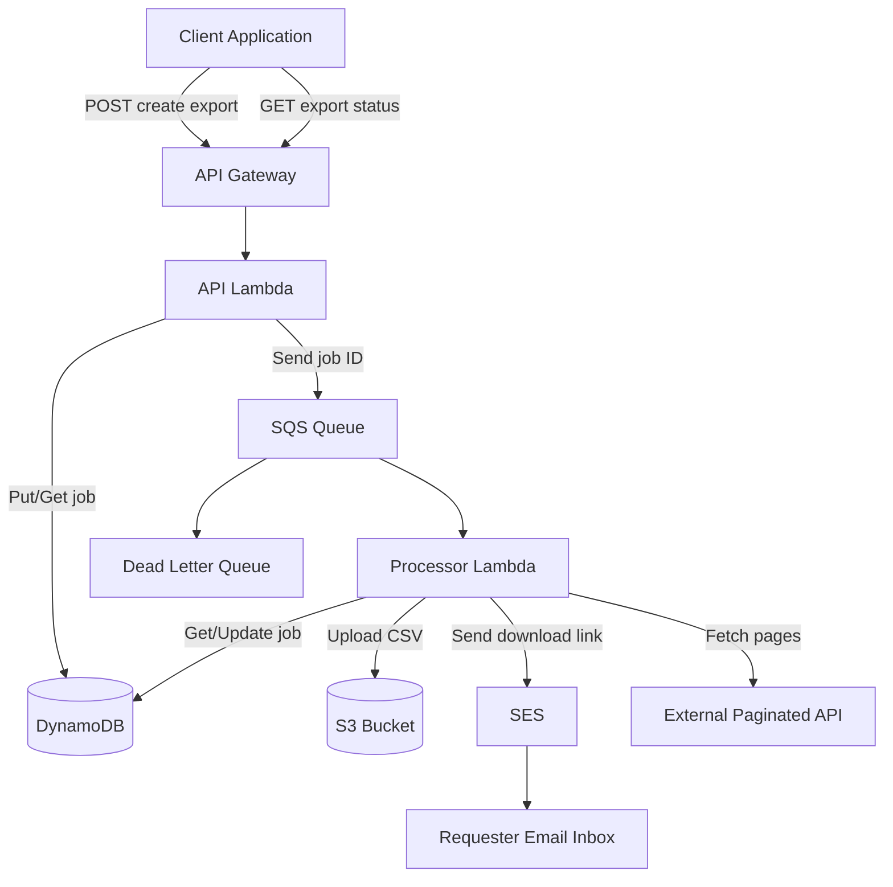
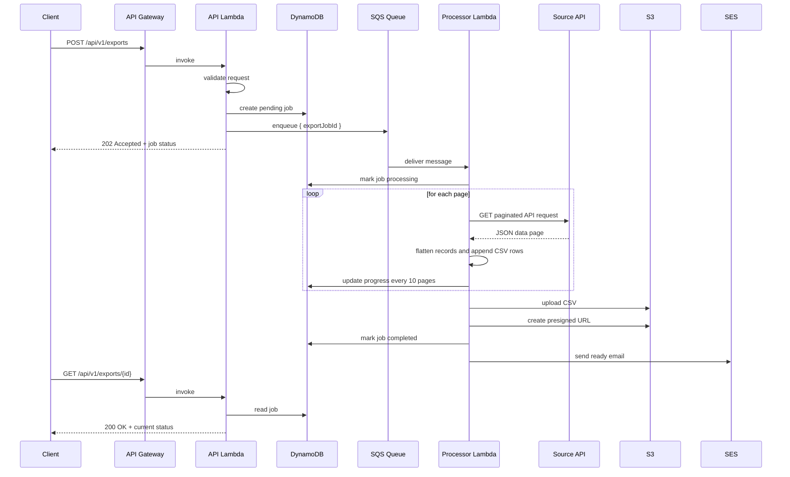

# Architecture

This document describes how `data-export-service` is assembled, how requests move through the system, and which implementation details matter when operating or extending it.

## System Context

## Main Components

### API Lambda

Responsibilities:

- handles `OPTIONS`, `POST /api/v1/exports`, and `GET /api/v1/exports/{id}`
- validates request bodies and UUID path parameters
- creates export jobs in DynamoDB
- publishes export job IDs to SQS
- returns normalized status and error responses

Key files:

- `src/handlers/api.ts`
- `src/lib/validator.ts`
- `src/lib/response.ts`
- `src/services/export-job.service.ts`
- `src/services/queue.service.ts`

### Processor Lambda

Responsibilities:

- consumes one SQS message at a time
- marks jobs as `processing`
- fetches remote API pages and writes a streaming CSV to temp storage
- uploads the result to S3
- creates a presigned download URL
- marks the job `completed` or `failed`
- sends the ready email via SES

Key files:

- `src/handlers/processor.ts`
- `src/lib/csv-builder.ts`
- `src/services/s3.service.ts`
- `src/services/email.service.ts`

### Persistence And Messaging

- DynamoDB stores the job record and progress counters.
- SQS decouples request intake from long-running work.
- S3 stores the final CSV object.
- SES delivers the download email to the requester.

## Sequence Diagram

## Job Data Model

The application-level export job model includes:

- identity and timestamps: `id`, `createdAt`, `updatedAt`, `startedAt`, `completedAt`
- request metadata: `apiUrl`, `email`, `paginationStrategy`, `headers`, `queryParams`
- extraction settings: `pageSize`, `dataPath`, `cursorPath`, `cursorParam`, `fileName`
- execution state: `status`, `attempts`, `pagesProcessed`, `totalRecords`, `errorMessage`
- delivery metadata: `s3Key`, `downloadUrl`

The public API only exposes a subset of that model through the status response.

## Pagination Strategies

### Page Pagination

- Adds `page` and `limit`.
- Starts with `page=1`.
- Good fit for APIs with page-numbered navigation.

### Offset Pagination

- Adds `offset` and `limit`.
- Computes `offset = currentPage * pageSize`.
- Good fit for APIs that use skip/offset semantics.

### Cursor Pagination

- Adds `limit`.
- Adds a cursor parameter after the first page.
- Reads the next cursor from `cursorPath`, defaulting to `meta.nextCursor`.
- Uses `cursorParam`, defaulting to `cursor`.

## CSV Generation Model

The service is optimized for bounded memory usage:

- records are fetched one page at a time
- rows are written to a file stream instead of building one large in-memory array
- nested objects are flattened using dot-notation keys
- arrays are serialized to JSON strings

Implication:

- the header row is derived from the first record only, so schema drift in later records is not normalized

## Failure Handling

Retry policy is split between SQS and the processor:

- SQS queue redrive policy allows `maxReceiveCount: 3`
- processor reads `ApproximateReceiveCount`
- attempts `1` and `2` rethrow errors so SQS can retry
- attempt `3` marks the job as `failed` and stops rethrowing

Implication:

- the final failed message is consumed after the job record is updated, so not every terminal failure will continue to the DLQ

## Security And Access Model

Current behavior defined by the template and handlers:

- CORS allows `*`
- no request authentication or authorization is configured
- S3 bucket blocks public access
- file delivery uses presigned URLs instead of public objects
- email sender identity must be valid for SES in the target AWS account

## Resource Sizing

From `template.yaml`:

- API Lambda: `256 MB`, `29s`
- Processor Lambda: `1024 MB`, `900s`, `2048 MB` ephemeral storage
- Queue visibility timeout: `960s`
- Export file retention in S3: `30 days`

## Operational Caveats

- progress in DynamoDB is only updated every `10` pages
- cursor pagination currently performs an additional fetch to read the next cursor value
- DynamoDB TTL is enabled in infrastructure, but the application does not currently persist a `ttl` attribute
- there is no built-in source API rate limiting beyond API Gateway throttling on the intake endpoint
