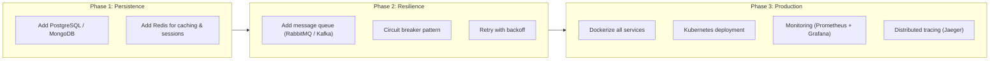

# Architecture Documentation

## Table of Contents

- [System Overview](#system-overview)
- [High-Level Architecture](#high-level-architecture)
- [Service Dependency Graph](#service-dependency-graph)
- [Request Flow Through the Gateway](#request-flow-through-the-gateway)
- [Authentication Flow](#authentication-flow)
- [Core Business Flows](#core-business-flows)
  - [User Registration & Login](#user-registration--login)
  - [Product Browsing](#product-browsing)
  - [Cart Management](#cart-management)
  - [Order Creation](#order-creation)
  - [Payment Processing](#payment-processing)
  - [Refund Processing](#refund-processing)
- [Data Architecture](#data-architecture)
  - [Domain Model](#domain-model)
  - [Entity Relationships](#entity-relationships)
  - [Data Ownership](#data-ownership)
- [Service Details](#service-details)
  - [API Gateway](#api-gateway)
  - [Auth Service](#auth-service)
  - [Product Service](#product-service)
  - [Cart Service](#cart-service)
  - [Order Service](#order-service)
  - [Payment Service](#payment-service)
- [Inter-Service Communication](#inter-service-communication)
- [Design Patterns](#design-patterns)
- [Tech Stack](#tech-stack)
- [Testing Architecture](#testing-architecture)
- [Known Limitations & Future Improvements](#known-limitations--future-improvements)

---

## System Overview

This is a **microservices-based e-commerce application** built with TypeScript and Express.js. It covers the full purchase lifecycle:

> **Register → Browse Products → Add to Cart → Place Order → Pay**

The system is composed of **5 domain services** and an **API Gateway**, each running as an independent process with its own in-memory data store.

---

## High-Level Architecture


### Port Allocation

| Service | Port | URL |
|---------|------|-----|
| API Gateway | `3000` | `http://localhost:3000` |
| Auth Service | `3001` | `http://localhost:3001` |
| Product Service | `3002` | `http://localhost:3002` |
| Cart Service | `3003` | `http://localhost:3003` |
| Order Service | `3004` | `http://localhost:3004` |
| Payment Service | `3005` | `http://localhost:3005` |

---

## Service Dependency Graph

This diagram shows how services depend on each other for data and operations. All inter-service calls are synchronous HTTP requests.


**Key observations:**
- **Product Service** is the most depended-upon service (called by Cart, Order, and Payment)
- **Auth Service** is only called by the Gateway for token validation
- **Cart Service** has no downstream dependents (only called by Order Service)
- No circular dependencies exist

---

## Request Flow Through the Gateway

Every client request passes through the API Gateway, which handles authentication and proxying.


### Public vs. Protected Routes

| Route Pattern | Authentication | Behavior |
|--------------|----------------|----------|
| `GET /health` | Not required | Returns gateway health status |
| `/api/auth/*` | Not required | Proxied directly to Auth Service |
| `/api/products/*` | Not required | Proxied directly to Product Service |
| `/api/cart/*` | **Required** | Token validated, then proxied with `x-user-id` |
| `/api/orders/*` | **Required** | Token validated, then proxied with `x-user-id` |
| `/api/payments/*` | **Required** | Token validated, then proxied with `x-user-id` |

---

## Authentication Flow

```mermaid
sequenceDiagram
    participant C as Client
    participant GW as API Gateway
    participant AUTH as Auth Service

    Note over C,AUTH: Registration
    C->>GW: POST /api/auth/register<br/>{email, name, password}
    GW->>AUTH: POST /register
    AUTH->>AUTH: Validate input<br/>Hash password (bcrypt)<br/>Store user
    AUTH-->>GW: {id, email, name, createdAt}
    GW-->>C: 201 Created

    Note over C,AUTH: Login
    C->>GW: POST /api/auth/login<br/>{email, password}
    GW->>AUTH: POST /login
    AUTH->>AUTH: Find user by email<br/>Verify password hash<br/>Generate UUID token
    AUTH-->>GW: {userId, email, token}
    GW-->>C: 200 OK with token

    Note over C,AUTH: Using Protected Routes
    C->>GW: GET /api/cart<br/>Authorization: Bearer <token>
    GW->>AUTH: POST /validate-token {token}
    AUTH->>AUTH: Look up token → userId
    AUTH-->>GW: {valid: true, userId}
    GW->>GW: Inject x-user-id header
    GW->>GW: Proxy to Cart Service
```



### Security Measures

| Feature | Implementation |
|---------|---------------|
| Password storage | bcrypt hash (salt rounds: 10) |
| Token format | UUID v4 |
| Token storage | In-memory map (token → userId) |
| Email validation | Regex pattern matching |
| Password policy | Minimum 8 characters |
| User isolation | `x-user-id` header enforced per request |

---

## Core Business Flows

### User Registration & Login


### Product Browsing


Search supports the following query parameters:
- `keyword` — matches against product name and description (case-insensitive)
- `category` — exact category match
- `minPrice` / `maxPrice` — price range filter

### Cart Management


### Order Creation

This is one of the most complex flows, involving three services:


**Order Status Lifecycle:**


### Payment Processing


### Refund Processing


---

## Data Architecture

### Domain Model


### Entity Relationships


### Data Ownership

Each service owns its data exclusively. No service reads or writes another service's store directly.


### Enumerations

**OrderStatus:**
| Value | Description |
|-------|-------------|
| `pending` | Order created, awaiting payment |
| `confirmed` | Payment completed successfully |
| `shipped` | Order has been shipped |
| `delivered` | Order delivered to customer |
| `cancelled` | Order cancelled (by user or refund) |

**PaymentStatus:**
| Value | Description |
|-------|-------------|
| `pending` | Payment initiated |
| `completed` | Payment processed successfully |
| `failed` | Payment processing failed |
| `refunded` | Payment has been refunded |

**PaymentMethod:**
| Value | Description |
|-------|-------------|
| `credit_card` | Credit card payment |
| `debit_card` | Debit card payment |
| `paypal` | PayPal payment |

---

## Service Details

### API Gateway

| | |
|---|---|
| **Port** | 3000 |
| **Owns Data** | None |
| **Responsibilities** | Request routing, authentication enforcement, request proxying |

The gateway is the single entry point for all client requests. It:

1. Receives incoming HTTP requests
2. Determines if the route is public or protected
3. For protected routes, validates the Bearer token via the Auth Service
4. Injects the `x-user-id` header into authenticated requests
5. Proxies the request to the appropriate downstream service
6. Returns the response to the client

### Auth Service

| | |
|---|---|
| **Port** | 3001 |
| **Owns Data** | Users, Tokens |
| **Responsibilities** | User registration, login, token generation & validation |

**Key behaviors:**
- Email must be unique and match a valid email pattern
- Password must be at least 8 characters, stored as bcrypt hash
- Tokens are UUID v4 strings mapped to user IDs
- The `/validate-token` endpoint is internal-only (used by Gateway)

### Product Service

| | |
|---|---|
| **Port** | 3002 |
| **Owns Data** | Products |
| **Responsibilities** | Product CRUD, catalog search, stock management |

**Key behaviors:**
- Products require name, description, price (> 0), category, and stock (>= 0)
- Search supports keyword (name/description), category, and price range filters
- Internal endpoints allow other services to look up products and update stock
- Stock validation and updates are central to order/payment flows

### Cart Service

| | |
|---|---|
| **Port** | 3003 |
| **Owns Data** | Carts |
| **Dependencies** | Product Service |
| **Responsibilities** | Cart CRUD, item management |

**Key behaviors:**
- Each user has at most one cart (created on first item add)
- Adding a product calls the Product Service to validate existence and stock
- Product name and price are denormalized into cart items
- If quantity is set to 0, the item is removed from the cart

### Order Service

| | |
|---|---|
| **Port** | 3004 |
| **Owns Data** | Orders |
| **Dependencies** | Cart Service, Product Service |
| **Responsibilities** | Order creation, lifecycle management |

**Key behaviors:**
- Creating an order pulls items from the user's cart
- Stock is validated and decremented for each item
- Cart is cleared after successful order creation
- Users can cancel orders that are in `pending` or `confirmed` status
- Stock is restored upon cancellation

### Payment Service

| | |
|---|---|
| **Port** | 3005 |
| **Owns Data** | Payments |
| **Dependencies** | Order Service, Product Service |
| **Responsibilities** | Payment processing, refund handling |

**Key behaviors:**
- Payment can only be made for orders in `pending` status
- Each order can have at most one payment
- Successful payment updates order status to `confirmed`
- Refunds restore stock for all items in the order and cancel the order
- Payment method must be one of: `credit_card`, `debit_card`, `paypal`

---

## Inter-Service Communication

All service-to-service communication uses **synchronous HTTP calls** through typed client interfaces.

### Communication Architecture


### Internal Endpoints

These endpoints are used exclusively for service-to-service communication and are not exposed through the API Gateway.

| Service | Method | Endpoint | Called By | Purpose |
|---------|--------|----------|-----------|---------|
| Auth | `POST` | `/validate-token` | Gateway | Validate auth token and return userId |
| Product | `GET` | `/internal/:id` | Cart, Order, Payment | Fetch product details |
| Product | `PUT` | `/internal/stock/:id` | Order, Payment | Update product stock level |
| Cart | `GET` | `/internal/:userId` | Order | Retrieve a user's cart |
| Cart | `DELETE` | `/internal/:userId` | Order | Clear a user's cart |
| Order | `GET` | `/internal/:id` | Payment | Fetch order details |
| Order | `PUT` | `/internal/:id/status` | Payment | Update order status |

---

## Design Patterns

| Pattern | Where | Why |
|---------|-------|-----|
| **API Gateway** | `gateway/app.ts` | Single entry point for all clients; centralizes auth, routing, and cross-cutting concerns |
| **Dependency Injection** | All services | Services accept client interfaces in constructors, enabling mock-based testing |
| **Factory Pattern** | `createApp()` in each service | Produces Express apps with injected dependencies for testability |
| **Service Result** | `ServiceResult<T>` | Consistent `{success, data?, error?, statusCode}` pattern across all service methods |
| **Data Denormalization** | CartItem, OrderItem | Product name/price copied into cart/order items to reduce cross-service calls at read time |
| **Database per Service** | All services | Each service owns its data store; no shared state between services |

---

## Tech Stack

| Layer | Technology |
|-------|-----------|
| **Language** | TypeScript (ES2020) |
| **Runtime** | Node.js |
| **Web Framework** | Express.js 4.x |
| **Authentication** | bcryptjs (password hashing) + UUID tokens |
| **ID Generation** | UUID v4 |
| **Testing** | Vitest + Supertest |
| **Linting** | ESLint + typescript-eslint |
| **Dev Server** | ts-node-dev (hot reload) |
| **Process Manager** | concurrently (multi-service dev) |
| **Storage** | In-memory (JavaScript `Map`) |

---

## Testing Architecture


| Test Type | Count | Framework | Approach |
|-----------|-------|-----------|----------|
| **Unit** | 73 | Vitest + Supertest | Each service tested in isolation with mock dependencies |
| **Integration** | 10 | Vitest + Supertest | All services started on random ports, tested end-to-end |
| **Total** | **83** | | |

### Running Tests

```bash
npm test                 # All tests (unit + integration)
npm run test:unit        # Unit tests only
npm run test:integration # Integration tests only
```

---

## Known Limitations & Future Improvements

### Current Limitations

| Area | Limitation |
|------|-----------|
| **Storage** | In-memory only — all data lost on restart |
| **Token Expiry** | Tokens never expire |
| **Rate Limiting** | No rate limiting on any endpoint |
| **Caching** | No caching layer |
| **Communication** | Synchronous HTTP only (no async messaging) |
| **Observability** | No distributed tracing, structured logging, or metrics |
| **Health Checks** | Only basic `/health` on gateway |
| **RBAC** | No role-based access control (e.g., admin vs. customer) |
| **Pagination** | Product search returns all matching results |
| **Idempotency** | No idempotency keys for payment/order operations |

### Suggested Improvements


