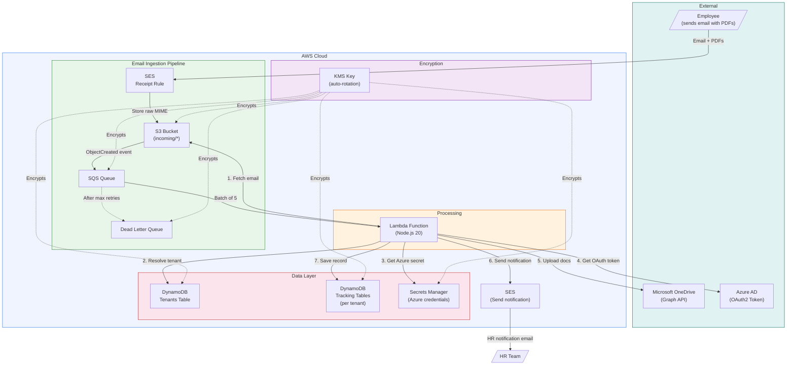
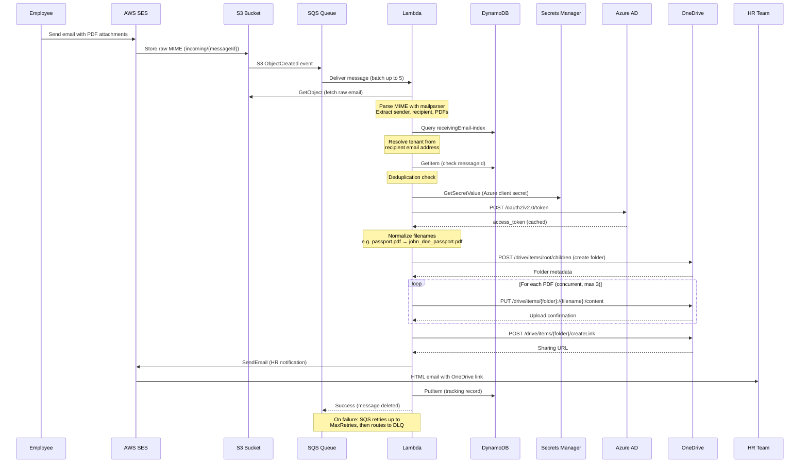
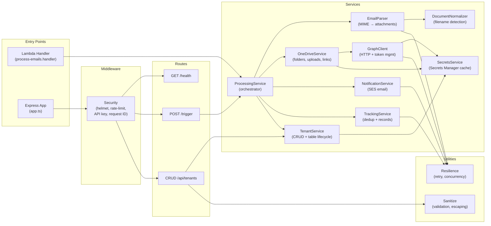
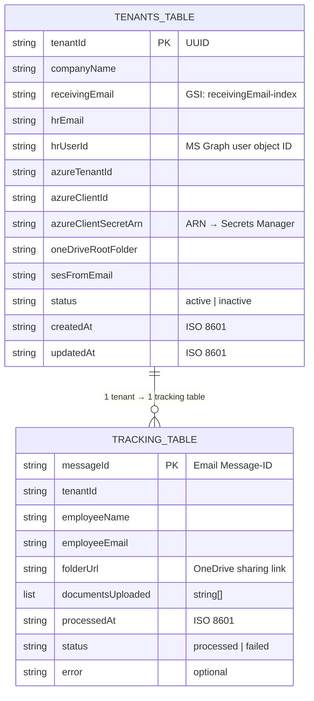
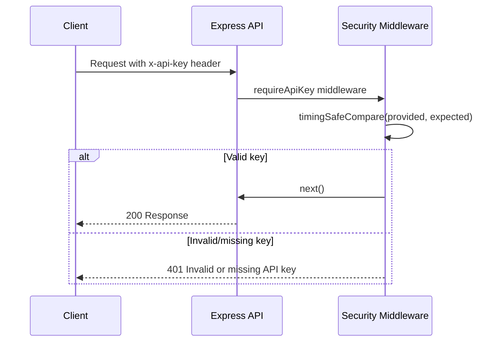

# Architecture Deep-Dive

This document provides a comprehensive technical overview of the Onboarding Document Tracker system architecture, design decisions, data flows, and component interactions.

## Table of Contents

- [System Architecture Diagram](#system-architecture-diagram)
- [Component Architecture](#component-architecture)
- [Data Flow](#data-flow)
- [Multi-Tenant Data Model](#multi-tenant-data-model)
- [Service Layer Design](#service-layer-design)
- [Resilience Patterns](#resilience-patterns)
- [Security Architecture](#security-architecture)
- [Infrastructure (AWS SAM)](#infrastructure-aws-sam)
- [Design Decisions](#design-decisions)

---

## System Architecture Diagram


### High-Level System Flow



### Component Interaction Sequence



---

## Component Architecture

### Application Layer



### Service Responsibilities

| Service | File | Responsibility |
|---------|------|----------------|
| **ProcessingService** | `processing.service.ts` | Top-level orchestrator. Coordinates the full email-to-OneDrive pipeline with error handling at each step. |
| **EmailParser** | `email-parser.ts` | Reads raw MIME from S3, parses with `mailparser`, extracts sender/recipient/PDFs, delegates filename normalization. |
| **DocumentNormalizer** | `document-normalizer.ts` | Detects document types from filenames via regex patterns, normalizes to `{employee}_{type}.pdf` format. |
| **OneDriveService** | `onedrive.service.ts` | Creates employee folders, uploads documents with bounded concurrency, generates sharing links. |
| **GraphClient** | `graph-client.ts` | Low-level Microsoft Graph HTTP client. Handles OAuth2 token acquisition, caching, retry, and 401 re-auth. |
| **NotificationService** | `notification.service.ts` | Composes and sends HTML email to HR via SES. All user values are HTML-escaped. |
| **TenantService** | `tenant.service.ts` | Full tenant lifecycle CRUD. Creates/deletes DynamoDB tracking tables and Secrets Manager secrets alongside tenant records. |
| **TrackingService** | `tracking.service.ts` | Manages per-tenant processing records. Provides deduplication check and failure recording. |
| **SecretsService** | `secrets.service.ts` | CRUD wrapper around AWS Secrets Manager with short-lived in-memory cache (5 min TTL). |

---

## Data Flow

### Email Processing Pipeline (Step by Step)

```
Step 1: PARSE
    S3 (raw MIME) → mailparser → EmployeeSubmission
    ├── messageId (from email headers or S3 key)
    ├── recipientEmail (tenant routing key)
    ├── employeeName (from sender display name or email)
    ├── employeeEmail (sender address)
    └── attachments[] (PDFs only)
        ├── originalName
        ├── normalizedName (via DocumentNormalizer)
        ├── contentBytes (base64)
        ├── contentType
        └── size

Step 2: RESOLVE TENANT
    recipientEmail → DynamoDB GSI query → Tenant
    ├── Verify tenant exists
    └── Verify tenant.status === 'active'

Step 3: DEDUPLICATION
    messageId + tenantId → DynamoDB GetItem
    └── Skip if already processed (status === 'processed')

Step 4: ONEDRIVE OPERATIONS
    a) Resolve Azure credentials (Secrets Manager → cache)
    b) Acquire Graph API token (OAuth2 → cache)
    c) Ensure root folder exists (GET or POST)
    d) Create employee subfolder (GET or POST)
    e) Upload PDFs concurrently (PUT, max 3 in parallel)
    f) Create organization-scoped sharing link (POST)

Step 5: NOTIFY
    ProcessingResult → SES SendEmail → HR inbox
    └── Non-critical: failure logged as warning, doesn't fail pipeline

Step 6: RECORD
    TrackingRecord → DynamoDB PutItem (per-tenant table)
    ├── status: 'processed' | 'failed'
    ├── documentsUploaded[]
    └── error (if any warnings)
```

### Document Normalization Flow

```
Input filename             Detected type        Normalized filename
─────────────────          ──────────────       ──────────────────────
"passport2.pdf"          → passport            → john_doe_passport.pdf
"my DL scan.pdf"         → driving_license     → john_doe_driving_license.pdf
"AADHAR_front.pdf"       → aadhaar             → john_doe_aadhaar.pdf
"random_doc.pdf"         → document            → john_doe_document.pdf
"passport.pdf" (2nd)     → passport            → john_doe_passport_2.pdf
```

When multiple files resolve to the same document type, a numeric suffix (`_2`, `_3`, etc.) is appended automatically.

---

## Multi-Tenant Data Model

### DynamoDB Schema



### Table Naming Convention

```
Tenants:    {stack-name}-tenants                     (shared, single table)
Tracking:   {stack-name}-tracking-{tenantId}         (per-tenant, isolated)
Secrets:    {stack-name}/tenants/{tenantId}/azure-client-secret
```

### Tenant Isolation Strategy

Each tenant's processing records are stored in a **dedicated DynamoDB table** rather than a shared table with a tenant partition key. This provides:

1. **Hard data isolation**: No possibility of cross-tenant data access via query mistakes
2. **Independent lifecycle**: Tables are created/deleted atomically with tenant registration
3. **Independent scaling**: Each table scales independently based on the tenant's volume
4. **Clean deletion**: Dropping a tenant's table removes all their data instantly

The trade-off is slightly higher operational overhead (more tables to monitor), but for a security-sensitive HR document system, the isolation benefits outweigh this cost.

---

## Resilience Patterns

### Retry with Exponential Backoff

All external service calls use the `withRetry` utility:

```
Attempt 1: immediate
Attempt 2: baseDelay * 2^0 + jitter  (500–1000ms)
Attempt 3: baseDelay * 2^1 + jitter  (1000–1500ms)
...
Capped at: maxDelay (15s)
```

The retry logic respects `Retry-After` headers from the Graph API (HTTP 429), using the server-specified delay instead of the calculated backoff.

**Retryable conditions:**
- Graph API: HTTP 429, 500, 502, 503, 504
- DynamoDB: `ProvisionedThroughputExceededException`, `ThrottlingException`, `InternalServerError`
- SES: `Throttling`, `ServiceUnavailableException`
- S3: Transient failures (via SDK auto-retry + application retry)

### Bounded Concurrency

Document uploads use `mapWithConcurrency` to limit parallel uploads to a configurable maximum (default: 3). This prevents overwhelming the Graph API and respects rate limits.

```
Documents: [A, B, C, D, E]   concurrency: 3

Time →
Worker 1: [A]────────[D]────────
Worker 2: [B]──────[E]──────────
Worker 3: [C]───────────────────
```

### Partial Success Handling

If some document uploads fail but others succeed:
- The successful uploads are preserved
- Failed uploads are recorded in the response as `documentsFailed`
- A tracking record is saved with `status: 'processed'` and warnings
- HR is still notified of the successfully uploaded documents

Only when **all** uploads fail does the pipeline report failure.

### SQS Batch Item Failures

The Lambda handler uses `ReportBatchItemFailures` to report which specific SQS messages failed, so only those messages are retried — not the entire batch. Messages that exhaust their `maxReceiveCount` are moved to the dead-letter queue.

### Non-Critical Notifications

HR email notifications are wrapped in a try/catch. If SES fails to send, the processing still succeeds — the documents are already on OneDrive. The failure is logged as a warning in the tracking record.

---

## Security Architecture

### Encryption Model

```
                    ┌──────────────────┐
                    │  KMS Key         │
                    │  (Auto-rotating) │
                    └────────┬─────────┘
                             │ Encrypts
          ┌──────────┬───────┼───────┬──────────┐
          ▼          ▼       ▼       ▼          ▼
       ┌─────┐  ┌──────┐ ┌─────┐ ┌──────┐ ┌─────────┐
       │ S3  │  │ SQS  │ │ DLQ │ │ DDB  │ │Secrets  │
       │     │  │Queue │ │     │ │Tables│ │Manager  │
       └─────┘  └──────┘ └─────┘ └──────┘ └─────────┘
```

All data at rest is encrypted with a single **customer-managed KMS key** with automatic annual rotation. The key policy grants:
- Root account: full access
- Lambda role: Decrypt, GenerateDataKey, DescribeKey
- SES service: Decrypt, GenerateDataKey (via S3)
- S3 service: Decrypt, GenerateDataKey (for SQS notifications)

### Authentication Flow



### Request Security Pipeline

Every request passes through this middleware chain:

```
Request
  │
  ├─ requestId         → Attach/propagate X-Request-Id
  ├─ securityHeaders   → Helmet (CSP, HSTS, X-Frame-Options, etc.)
  ├─ cors              → CORS with configurable origins
  ├─ compression       → Gzip response compression
  ├─ rejectOversizedBody → Hard Content-Length check
  ├─ express.json      → Parse JSON with size limit
  ├─ apiRateLimiter    → Per-IP rate limiting
  │
  └─ Route handler
       ├─ requireApiKey  → Timing-safe API key validation
       ├─ pickAllowedFields → Allowlist fields (mass-assignment protection)
       ├─ validateTenantInput → Type, length, format validation
       └─ sanitizeTenant → Strip secret ARN from responses
```

---

## Infrastructure (AWS SAM)

### Resource Map

| Resource | Type | Purpose |
|----------|------|---------|
| `TenantDataKey` | KMS::Key | Customer-managed encryption key with auto-rotation |
| `TenantDataKeyAlias` | KMS::Alias | Human-readable alias for the KMS key |
| `EmailBucket` | S3::Bucket | Stores raw MIME emails from SES; encrypted, versioned, lifecycle rules |
| `EmailBucketPolicy` | S3::BucketPolicy | Allows SES PutObject, denies unencrypted uploads, enforces SSL |
| `EmailProcessingQueue` | SQS::Queue | Buffers S3 events; 6min visibility timeout, 4-day retention |
| `EmailProcessingDLQ` | SQS::Queue | Dead-letter queue; 14-day retention |
| `EmailQueuePolicy` | SQS::QueuePolicy | Allows S3 to send messages |
| `ProcessEmailFunctionRole` | IAM::Role | Lambda execution role with least-privilege policies |
| `ProcessEmailFunction` | Serverless::Function | Lambda function; 5min timeout, 512MB, 5 reserved concurrency |
| `SesReceiptRuleSet` | SES::ReceiptRuleSet | Email receipt rule set (must be activated manually) |
| `SesReceiptRule` | SES::ReceiptRule | Routes domain emails to S3 with TLS and virus scanning |
| `TenantsTable` | DynamoDB::Table | Tenant configurations; PAY_PER_REQUEST, PITR, deletion protection |

### Lambda Configuration

| Setting | Value | Rationale |
|---------|-------|-----------|
| Runtime | Node.js 20.x | LTS with native fetch support |
| Timeout | 300s (5 min) | Email parsing + multiple Graph API calls |
| Memory | 512 MB | Sufficient for PDF processing |
| Reserved Concurrency | 5 | Prevents overwhelming Graph API |
| SQS Batch Size | 5 | Balanced throughput vs. processing time |
| Visibility Timeout | 360s | 6x Lambda timeout for safety margin |

### S3 Lifecycle

| Rule | Action |
|------|--------|
| Processed emails | Expire after 90 days |
| Old versions | Delete after 30 days |

---

## Design Decisions

### Why SQS between S3 and Lambda (instead of direct S3 → Lambda)?

SQS provides retry semantics, dead-letter queue support, and batch processing. Direct S3 triggers would lose the message on Lambda failure with no built-in retry mechanism. SQS also acts as a buffer during traffic spikes.

### Why per-tenant DynamoDB tables (instead of a single shared table)?

For an HR document system handling sensitive employee data (passports, SSNs, etc.), hard data isolation between tenants is a priority. Per-tenant tables eliminate the risk of cross-tenant data leakage from query bugs, provide clean deletion semantics, and allow independent scaling.

### Why in-memory caching for tokens and secrets?

Microsoft Graph tokens are valid for ~1 hour, and Secrets Manager values change infrequently. Caching avoids per-request round trips to Azure AD and Secrets Manager, reducing both latency and cost. Token cache entries are evicted 60 seconds before expiry to prevent using expired tokens.

### Why `mailparser` instead of regex parsing?

Raw MIME emails have complex encoding (quoted-printable, base64, multipart boundaries, character sets). `mailparser` handles all edge cases correctly and is a well-maintained library specifically designed for this purpose.

### Why bounded concurrency for uploads instead of Promise.all?

The Microsoft Graph API has rate limits. Uploading all documents simultaneously with `Promise.all` could trigger 429 errors for emails with many attachments. Bounded concurrency (default: 3) provides good throughput while respecting rate limits.

### Why non-blocking HR notifications?

The primary value is getting documents into OneDrive. If SES is temporarily unavailable, failing the entire pipeline would mean re-downloading, re-parsing, and re-uploading documents unnecessarily. The notification failure is recorded as a warning for operational visibility.

### Why Express.js in a Lambda?

The same Express app can run locally as a dev server (`npm run dev`) or inside a Docker container, while the Lambda handler entry point processes SQS events directly. This provides deployment flexibility and a natural local development experience with the full API surface available.
