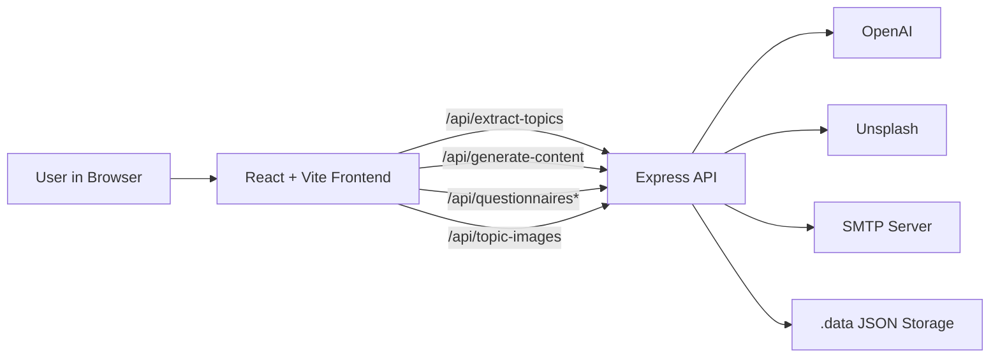
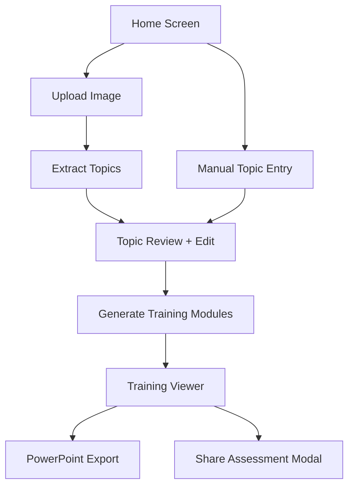
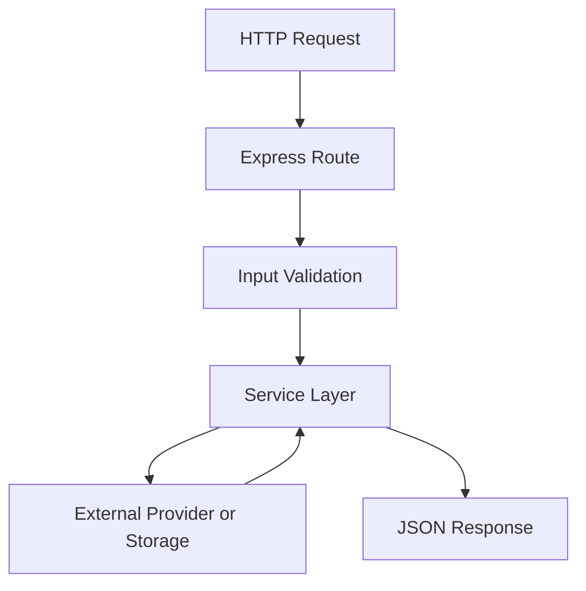
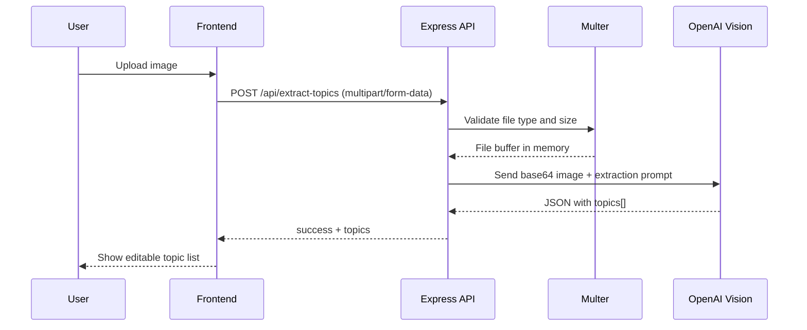
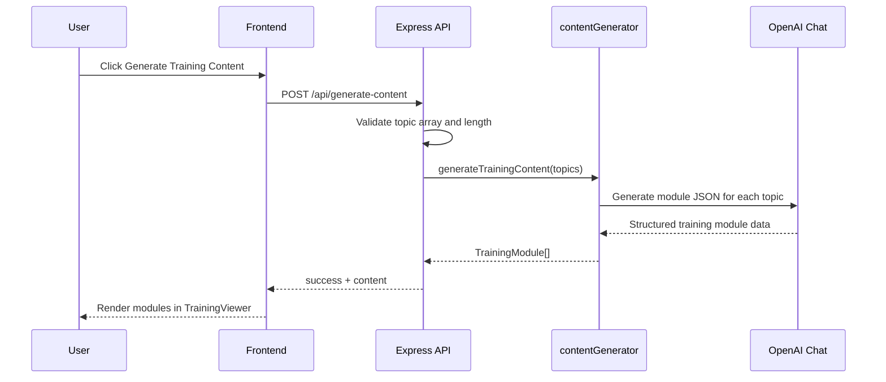
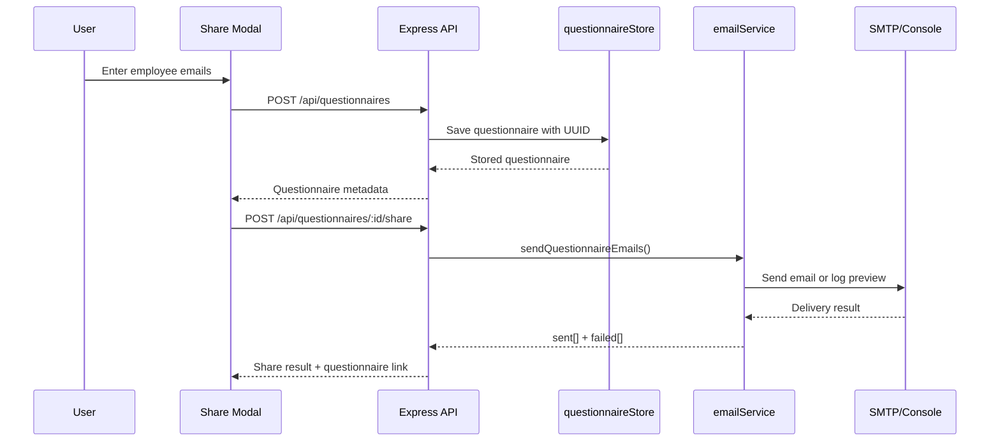
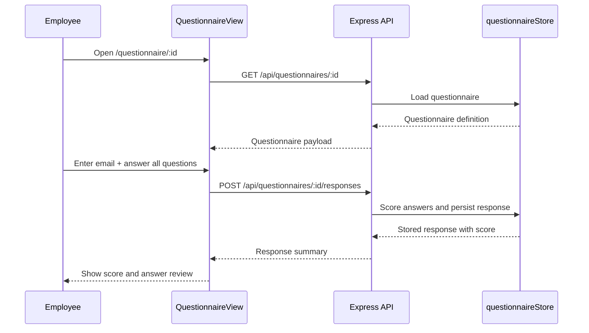

# Training Content Generator

Training Content Generator is a full-stack application for turning source material into employee training assets. Users can upload an image of notes, slides, or diagrams, extract training topics with AI, review or edit those topics, generate structured learning modules, export the result to PowerPoint, and distribute questionnaire-based assessments to employees.

The repository contains both the frontend and backend in a single package:

- `src/`: React + Vite client application
- `server/`: Express API, AI integrations, email sharing, and file-based persistence

## What The App Does

The product supports two primary workflows:

1. Content creation
   - Upload an image or enter topics manually
   - Review and edit up to 10 topics
   - Generate AI-authored training modules
   - Export the modules to a branded PowerPoint deck
2. Assessment distribution
   - Convert generated module questions into a questionnaire
   - Email the questionnaire link to employees
   - Collect submissions and score them automatically
   - View response summaries in a dashboard

## Tech Stack

### Frontend

- React 19
- TypeScript
- Vite 6
- React Router
- Tailwind CSS
- `react-dropzone` for image uploads
- `react-markdown` for rendering generated content
- `pptxgenjs` for PowerPoint export

### Backend

- Node.js
- Express 4
- TypeScript executed with `tsx`
- `multer` for in-memory image upload handling
- OpenAI for image analysis and content generation
- Unsplash for optional topic imagery
- Nodemailer for email delivery
- JSON files in `.data/` for persistence

## Project Structure

```text
training-content-generator/
|-- server/
|   |-- app.ts
|   |-- index.ts
|   `-- services/
|       |-- contentGenerator.ts
|       |-- emailService.ts
|       |-- imageAnalyzer.ts
|       |-- imageSearch.ts
|       `-- questionnaireStore.ts
|-- src/
|   |-- api/client.ts
|   |-- components/
|   |   |-- ImageUpload.tsx
|   |   |-- QuestionnaireView.tsx
|   |   |-- ResponsesViewer.tsx
|   |   |-- ShareModal.tsx
|   |   |-- TopicManager.tsx
|   |   `-- TrainingViewer.tsx
|   |-- types/index.ts
|   |-- utils/pptExport.ts
|   |-- App.tsx
|   `-- main.tsx
|-- .env.example
|-- package.json
`-- vite.config.ts
```

## Local Development

### Prerequisites

- Node.js 18+
- An OpenAI API key
- Optionally, an Unsplash access key for presentation imagery
- Optionally, SMTP credentials for sending real emails

### Environment Variables

Create a `.env` file from `.env.example`.

| Variable | Required | Purpose |
| --- | --- | --- |
| `OPENAI_API_KEY` | Yes | Used by the backend for topic extraction and training generation |
| `UNSPLASH_ACCESS_KEY` | No | Enables topic image lookup for PowerPoint export |
| `PORT` | No | Express server port, defaults to `3001` |
| `SMTP_HOST` | No | SMTP server host |
| `SMTP_PORT` | No | SMTP server port |
| `SMTP_USER` | No | SMTP username |
| `SMTP_PASS` | No | SMTP password |
| `SMTP_FROM` | No | Sender address used in questionnaire emails |
| `APP_URL` | No | Base URL used to generate questionnaire links |

If SMTP is not configured, the app still works: email sends are simulated by logging the email preview to the server console.

### Install And Run

```bash
npm install
npm run dev
```

This starts:

- the Vite frontend on `http://localhost:5173`
- the Express backend on `http://localhost:3001`

In development, Vite proxies `/api/*` requests to the Express server.

## Architecture Overview

The application is intentionally simple: a browser client talks to a single Express API, which orchestrates AI services, email delivery, and local JSON persistence.



## Frontend Architecture

### Routing Model

The frontend exposes three route-level experiences:

| Route | Component | Purpose |
| --- | --- | --- |
| `/` | `App` | Main training-generation workflow |
| `/questionnaire/:id` | `QuestionnaireView` | Employee assessment completion |
| `/responses/:id` | `ResponsesViewer` | Response dashboard for a generated questionnaire |

### Frontend Responsibilities

- Collect user inputs
- Upload source images
- Display extracted topics for review and editing
- Render generated learning modules
- Export modules to PowerPoint
- Create questionnaires from generated assessment questions
- Share questionnaire links
- Render questionnaire completion and response dashboards

### Main UI Flow

The default route is a small state machine driven by `view` in `App.tsx`:

- `home`
  - Upload an image or choose manual topic entry
- `topics`
  - Review extracted topics
  - Add, edit, or remove topics
  - Generate training content
- `content`
  - Browse generated modules
  - Review objectives, content sections, takeaways, and quiz questions
  - Download a PowerPoint deck
  - Share an assessment



### Key Frontend Modules

| File | Responsibility |
| --- | --- |
| `src/App.tsx` | Controls the main generation flow |
| `src/components/ImageUpload.tsx` | Handles drag-and-drop image upload and topic extraction |
| `src/components/TopicManager.tsx` | Lets users refine topics before generation |
| `src/components/TrainingViewer.tsx` | Displays generated modules and provides export/share actions |
| `src/components/ShareModal.tsx` | Creates questionnaires and triggers email sharing |
| `src/components/QuestionnaireView.tsx` | Lets employees complete an assessment |
| `src/components/ResponsesViewer.tsx` | Shows aggregate questionnaire results |
| `src/api/client.ts` | Centralizes frontend API calls |
| `src/utils/pptExport.ts` | Builds the downloadable PowerPoint presentation |

### PowerPoint Export Flow

PowerPoint generation happens entirely in the browser:

- The frontend requests optional topic images from `/api/topic-images`
- If an image is available, it is embedded in slides
- If not, the frontend generates abstract art locally on a canvas
- `pptxgenjs` composes slides for cover, agenda, module content, takeaways, quiz, and closing
- The browser downloads `Training-Materials.pptx`

This keeps export logic client-side and avoids server-side document generation complexity.

## Backend Architecture

### Backend Responsibilities

- Expose the REST API consumed by the frontend
- Validate incoming requests
- Convert uploaded images to AI-readable payloads
- Generate structured training content from topics
- Search for optional topic images
- Create and retrieve questionnaires
- Score questionnaire submissions
- Send or simulate email sharing
- Persist questionnaires and responses to disk

### Express Composition

- `server/index.ts`
  - Loads environment variables
  - Starts the Express server
- `server/app.ts`
  - Configures middleware
  - Defines all API routes
  - Connects routes to service-layer functions

### Service Layer

| Service | Purpose |
| --- | --- |
| `imageAnalyzer.ts` | Sends image content to OpenAI Vision and extracts topic names |
| `contentGenerator.ts` | Generates full training modules from topics using OpenAI |
| `imageSearch.ts` | Queries Unsplash and returns base64-encoded images |
| `questionnaireStore.ts` | Persists questionnaires and responses in `.data/*.json` |
| `emailService.ts` | Sends assessment emails via SMTP or logs a preview |

### Backend Data Flow



## Detailed Request Flows

### 1. Image To Topics Flow

When a user uploads an image, the app extracts training topics from it:



Implementation notes:

- Uploads are limited to image MIME types
- Files are kept in memory, not written to disk
- Topic extraction returns between 1 and 10 topics

### 2. Topics To Training Content Flow

After the topics are confirmed, the app generates full training modules:



Implementation notes:

- The backend limits generation to 10 topics per request
- `contentGenerator.ts` processes topics in batches of 3
- Each topic becomes a `TrainingModule` with:
  - overview
  - learning objectives
  - content sections
  - key takeaways
  - assessment questions
  - estimated duration

### 3. Questionnaire Creation And Sharing Flow

Sharing an assessment is a two-step backend workflow initiated by the frontend modal:



Implementation notes:

- The questionnaire title is built from the generated module topics
- Only the assessment questions are stored, not the full learning content
- Email sending gracefully degrades to console logging if SMTP is missing

### 4. Assessment Submission Flow

Employees complete the questionnaire from a shared URL:



Implementation notes:

- Answers are keyed by question index as strings
- Scoring is computed server-side against stored correct answers
- A score of 70% or higher is treated as a pass in the UI

### 5. Response Dashboard Flow

Managers can review outcome summaries on the responses page:

- Frontend loads the questionnaire and response list in parallel
- Backend reads questionnaire and filtered response records from local JSON files
- UI computes average score and pass count client-side
- The page supports manual refresh to reload responses

## API Reference

### Health

| Method | Path | Description |
| --- | --- | --- |
| `GET` | `/api/health` | Simple health check |

### AI And Content Endpoints

| Method | Path | Description |
| --- | --- | --- |
| `POST` | `/api/extract-topics` | Accepts an uploaded image and returns extracted topics |
| `POST` | `/api/generate-content` | Accepts topic names and returns training modules |
| `POST` | `/api/topic-images` | Accepts topic/image queries and returns base64 image data |

### Questionnaire Endpoints

| Method | Path | Description |
| --- | --- | --- |
| `POST` | `/api/questionnaires` | Creates a questionnaire from module questions |
| `GET` | `/api/questionnaires/:id` | Fetches one questionnaire |
| `POST` | `/api/questionnaires/:id/responses` | Submits and scores an employee response |
| `GET` | `/api/questionnaires/:id/responses` | Returns all responses for a questionnaire |
| `POST` | `/api/questionnaires/:id/share` | Sends the questionnaire link to email recipients |

## Data Model

### TrainingModule

This object is generated by the AI content service and consumed by the frontend.

```ts
interface TrainingModule {
  topic: string;
  overview: string;
  learningObjectives: string[];
  content: { title: string; body: string }[];
  keyTakeaways: string[];
  assessmentQuestions: {
    question: string;
    options: string[];
    correctAnswer: number;
    explanation: string;
  }[];
  estimatedDuration: string;
}
```

### Stored Questionnaire

Questionnaires are persisted to `.data/questionnaires.json`.

```ts
interface StoredQuestionnaire {
  id: string;
  title: string;
  createdAt: string;
  modules: {
    topic: string;
    questions: AssessmentQuestion[];
  }[];
}
```

### Stored Response

Responses are persisted to `.data/responses.json`.

```ts
interface StoredResponse {
  id: string;
  questionnaireId: string;
  employeeEmail: string;
  submittedAt: string;
  answers: Record<string, number>;
  score: number;
  totalQuestions: number;
}
```

## Storage Strategy

The app uses local JSON files rather than a database:

- `.data/questionnaires.json`
- `.data/responses.json`

This is lightweight and easy to reason about for demos and prototypes, but it also means:

- persistence is local to the server instance
- concurrent writes are not coordinated
- there is no indexing, audit trail, or access control
- data is not durable across stateless deployments unless the volume is persisted

## Security And Operational Notes

### Current Simplicity

The current implementation is optimized for speed of delivery and local/demo use:

- No user authentication or authorization
- Questionnaire URLs are accessible by ID alone
- Employee identity is captured through a text email field
- No rate limiting on AI or questionnaire endpoints
- Uploaded files are validated by MIME type but not deeply inspected
- Persistence is file-based, not transactional

### Implications

For production use, you would likely want to add:

- authentication and role-based access control
- signed or expiring questionnaire links
- server-side input sanitization and stronger validation
- rate limiting and request quotas
- a real database
- background jobs for email delivery
- monitoring, retry handling, and audit logging

## How Frontend And Backend Fit Together

The frontend is intentionally thin: it mostly gathers inputs, renders state, and delegates business logic to the backend. The backend owns the important side effects:

- calling OpenAI
- calling Unsplash
- sending email
- scoring assessments
- reading and writing persisted data

This keeps API boundaries clear and prevents browser code from needing direct access to secret credentials.

## Suggested Next Improvements

- Add authentication for creators and managers
- Move persistence from JSON files to a database
- Add background processing for content generation and email sending
- Add server-side caching for repeated image lookups
- Add automated tests for route validation and questionnaire scoring
- Add deployment documentation for cloud hosting
